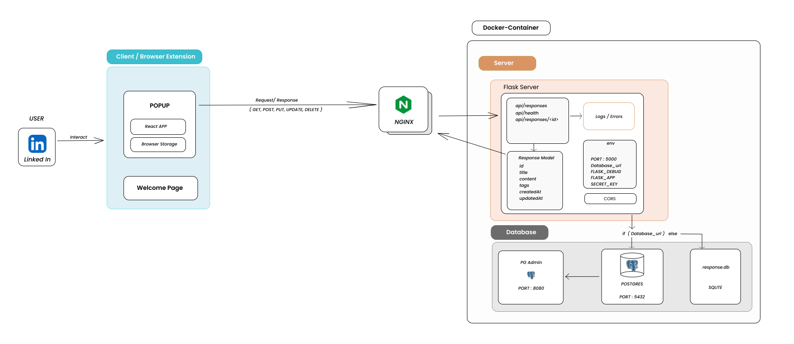

# Canner - AI-Powered LinkedIn & Twitter Assistant

> 🚀 A sophisticated browser extension and backend system that enhances your social media productivity with AI-powered response suggestions and seamless content management.

[](https://opensource.org/licenses/MIT)
[](https://docker.com)
[](https://www.typescriptlang.org/)
[](https://python.org)

## ✨ Features
- Select from a variety of pre-defined response templates
- Format linked post with Ease
- API Monitoring Dashboard (Flask backend + React/TypeScript frontend)

## 🏗 Architecture

Here’s an overview of how **Canner** works internally:



## 📄 **Contributing**

We welcome contributions! Please see our [Contributing Guide](CONTRIBUTING.md) for details.
- Join our Discord community for discussions and support. [Join Discord](https://discord.com/invite/the-cloudops-community-1030513521122885642)


## 🚀 Quick Start
A detailed Quick Start is written in our [Contributing Guide](CONTRIBUTING.md). You can go through it for more details. 

### API Monitoring Dashboard

This project now includes a complete API Monitoring Dashboard with:

1. **Flask Backend** (`server/`)
   - Tracks every request's endpoint name, HTTP method, response status code, and response time
   - Provides endpoints for metrics, recent logs, and health checks
   - Stores metrics in memory (no external database required)

2. **React/TypeScript Frontend** (`client/dashboard/`)
   - Modern dashboard with real-time updates (auto-refresh every 30 seconds)
   - Summary cards with total requests, average latency, and error rate
   - Table of endpoints with metrics
   - Interactive charts visualizing request trends and latency
   - Responsive design with ShadCN UI components

### Running the Dashboard

**Backend (Flask):**
```bash
# Navigate to the server directory
cd server

# Install dependencies
pip install -r requirements.txt

# Run the server
python app.py
# Server will start on http://localhost:5000
```

**Frontend (React/TypeScript):**
```bash
# Navigate to the client/dashboard directory
cd client/dashboard

# Install dependencies
npm install

# Start the development server
npm run dev
# Dashboard will be available at http://localhost:8080
```

### Monitoring with Prometheus and Grafana (Docker Compose)

This repository includes a ready-to-run monitoring stack for the Flask backend with Prometheus and Grafana.

```bash
# Build and start all services
docker-compose up -d --build

# Services
# - Backend (Flask):      http://localhost:5000
# - Prometheus UI:        http://localhost:9090
# - Grafana UI:           http://localhost:3000  (admin/admin)
```

- Prometheus is configured to scrape the backend at `backend:5000/metrics` via `monitoring/prometheus/prometheus.yml`.
- Grafana auto-provisions a Prometheus data source and a starter dashboard.
  - Data source config: `monitoring/grafana/provisioning/datasources/datasource.yml`
  - Dashboards provider: `monitoring/grafana/provisioning/dashboards/dashboards.yml`
  - Starter dashboard JSON: `monitoring/grafana/dashboards/api-dashboard.json`

Access Grafana at `http://localhost:3000` and log in with `admin/admin` (change after first login). The "API Metrics Overview" dashboard will appear automatically and includes:

- Request rate
- Error rate
- Latency percentiles (p50/p90/p99)
- Requests by status code and endpoint

To view raw metrics in Prometheus, open `http://localhost:9090` and query metrics like `flask_http_request_total` or `flask_http_request_duration_seconds_bucket`.

## **License**

This project is licensed under the MIT License - see the [LICENSE](LICENSE) file for details.

## 📞 **Support**

- 📧 **Email**: [baivab@techtutorialswithpiyush.com](mailto:baivab@techtutorialswithpiyush.com)
- 🐛 **Issues**: [GitHub Issues](https://github.com/piyushsachdeva/canner/issues)
- 💬 **Discord**: [Join our Discord](https://discord.com/invite/the-cloudops-community-1030513521122885642)

Made with ❤️ for developers who type the same things repeatedly
