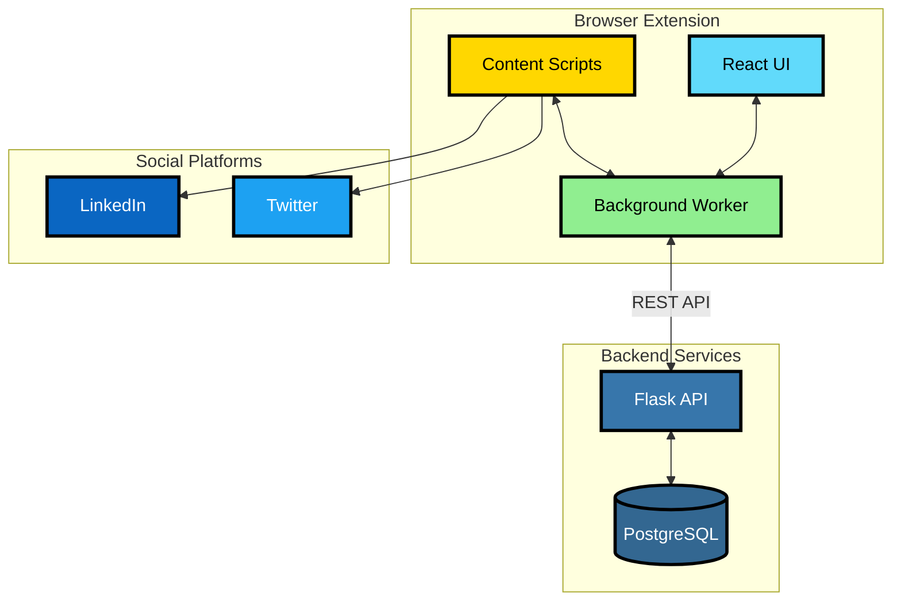

# Canner - AI-Powered LinkedIn & Twitter Assistant

> 🚀 A sophisticated browser extension and backend system that enhances your social media productivity with AI-powered response suggestions and seamless content management.

## ✨ Features
- Select from a variety of pre-defined response templates
- Format linkedin post with Ease

## 🏗️ Architecture

Canner is built with a modern, scalable architecture:

```mermaid
graph TB
    subgraph "Browser Extension"
        UI[React UI]
        CS[Content Scripts]
        BG[Background Worker]
    end
    
    subgraph "Backend Services"
        API[Flask API]
        DB[(PostgreSQL)]
    end
    
    subgraph "Social Platforms"
        LI[LinkedIn]
        TW[Twitter]
    end
    
    UI <--> BG
    CS --> LI
    CS --> TW
    CS <--> BG
    BG <-->|REST API| API
    API <--> DB
    
    style UI fill:#61dafb,stroke:#000,stroke-width:3px,color:#000
    style API fill:#3776ab,stroke:#000,stroke-width:3px,color:#fff
    style DB fill:#336791,stroke:#000,stroke-width:3px,color:#fff
    style CS fill:#ffd700,stroke:#000,stroke-width:3px,color:#000
    style BG fill:#90ee90,stroke:#000,stroke-width:3px,color:#000
    style LI fill:#0a66c2,stroke:#000,stroke-width:3px,color:#fff
    style TW fill:#1da1f2,stroke:#000,stroke-width:3px,color:#fff
```

**📚 For detailed architecture documentation, see [docs/ARCHITECTURE.md](docs/ARCHITECTURE.md)**

Key Components:
- **Browser Extension** (TypeScript + React): User interface and social media integration
- **Flask Backend** (Python 3.12): RESTful API with Swagger documentation
- **PostgreSQL Database**: Persistent storage for response templates
- **Docker Compose**: Containerized deployment for easy setup

## 📄 **Contributing**

We welcome contributions! Please see our [Contributing Guide](CONTRIBUTING.md) for details.
- Join our Discord community for discussions and support. [Join Discord](https://discord.com/invite/the-cloudops-community-1030513521122885642)

## 🚀 Quick Start
A detailed Quick Start is written in our [Contributing Guide](CONTRIBUTING.md). You can go through it for more details. 

## **License**

This project is licensed under the MIT License - see the [LICENSE](LICENSE) file for details.

## 📞 **Support**

- 📧 **Email**: [baivab@techtutorialswithpiyush.com](mailto:baivab@techtutorialswithpiyush.com)
- 🐛 **Issues**: [GitHub Issues](https://github.com/piyushsachdeva/canner/issues)
- 💬 **Discord**: [Join our Discord](https://discord.com/invite/the-cloudops-community-1030513521122885642)

Made with ❤️ for developers who type the same things repeatedly
