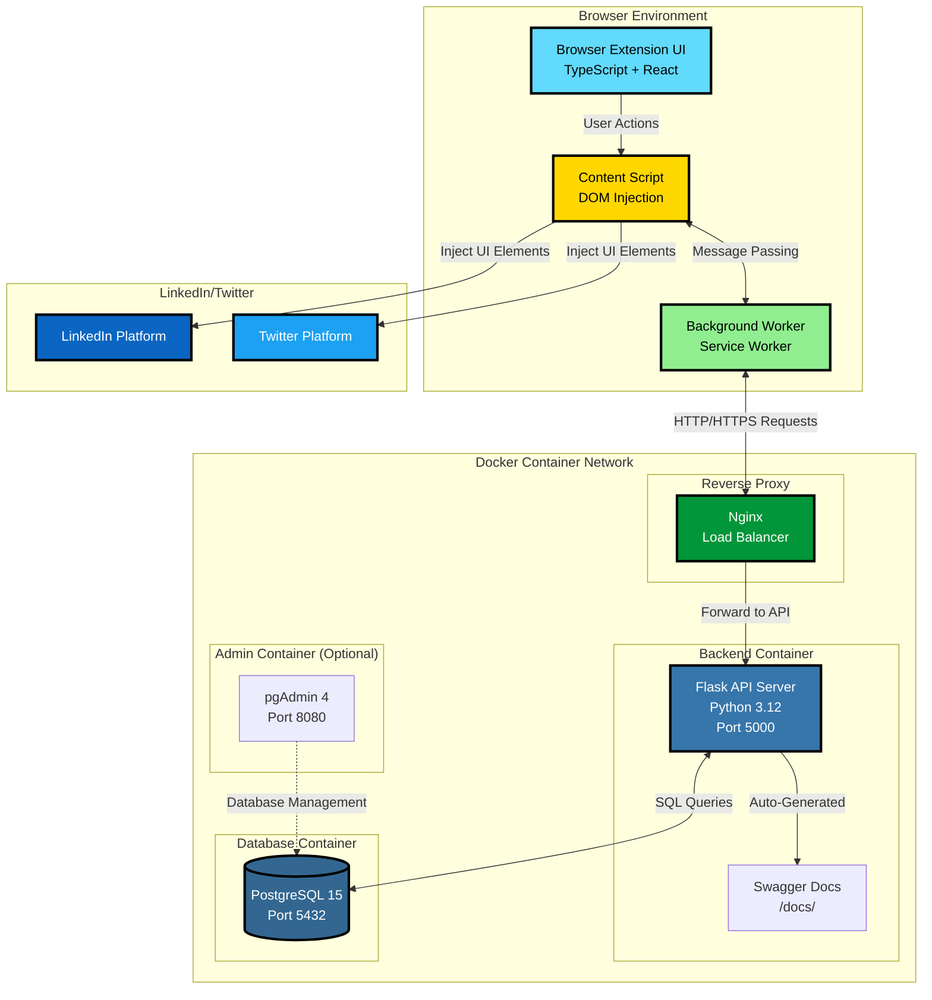
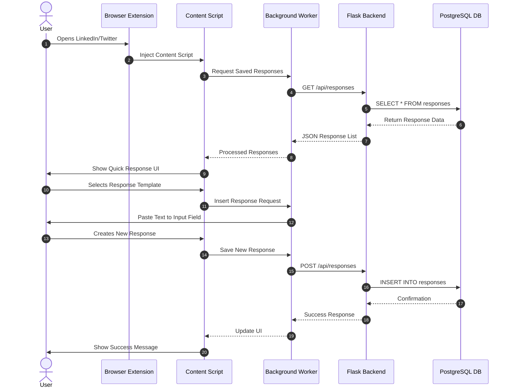
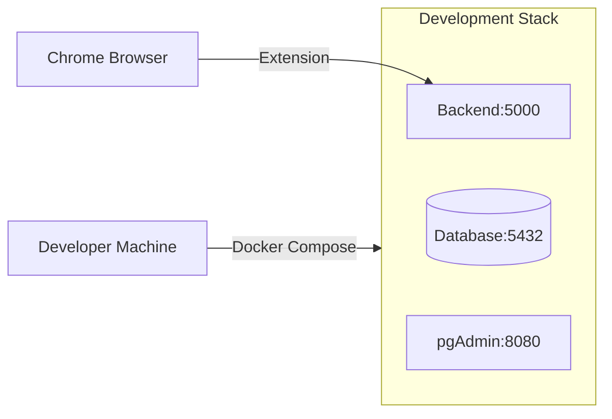
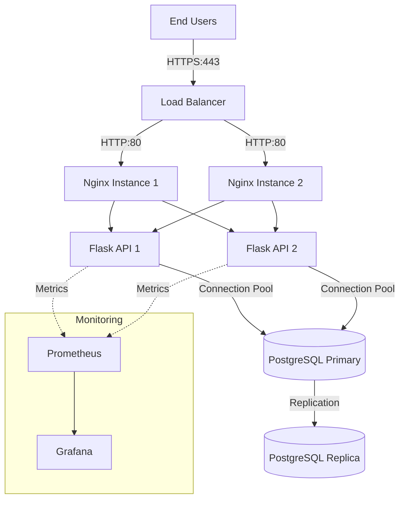
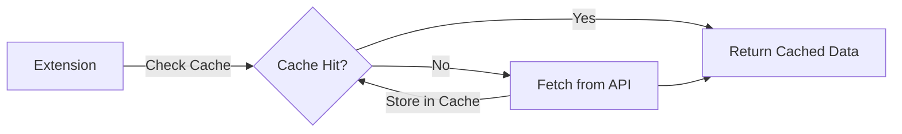
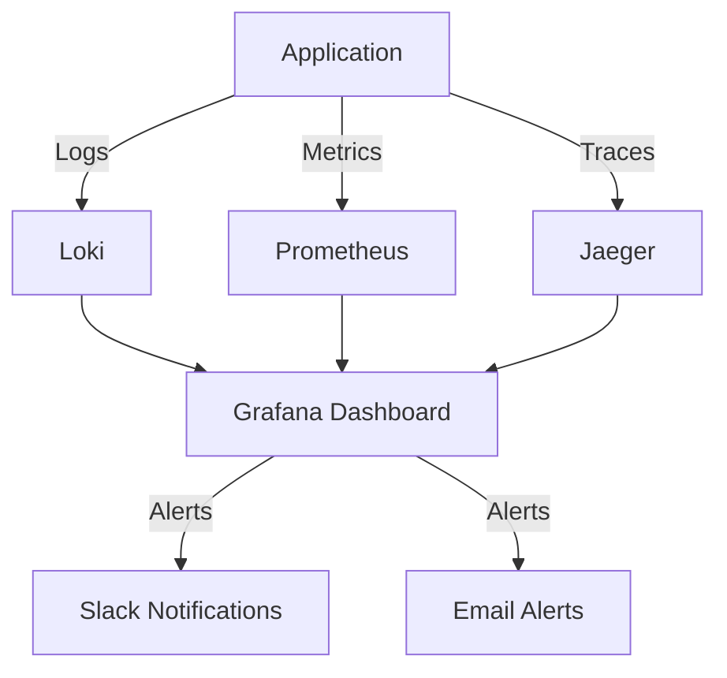
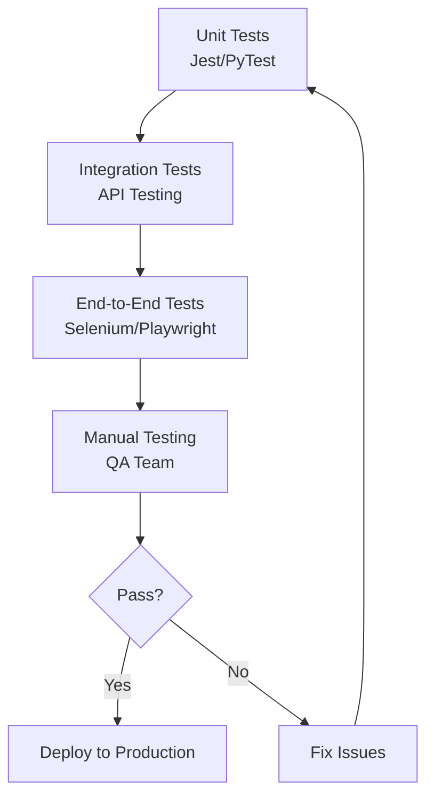

# Canner - System Architecture

> Complete architectural overview of the Canner AI-Powered LinkedIn & Twitter Assistant

## 📋 Table of Contents

- [Overview](#overview)
- [Architecture Diagram](#architecture-diagram)
- [System Components](#system-components)
- [Data Flow](#data-flow)
- [Technology Stack](#technology-stack)
- [Deployment Architecture](#deployment-architecture)
- [Security Considerations](#security-considerations)

---

## Overview

Canner is a distributed system consisting of a browser extension frontend and a Flask backend, with PostgreSQL as the data store. The system is containerized using Docker and orchestrated with Docker Compose for seamless development and deployment.

### Key Characteristics

- **Client-Server Architecture**: Browser extension communicates with Flask API
- **Microservices-Ready**: Containerized components can scale independently
- **Cross-Platform**: Works on Chrome and Firefox browsers
- **RESTful API**: Clean API design with Swagger documentation
- **Real-time Sync**: Response templates sync across sessions

---

## Architecture Diagram

### High-Level System Architecture



### Component Interaction Flow



---

## System Components

### 1. Browser Extension (Frontend)

**Location**: `/browser-extension/`

#### Components:

##### a) **Popup UI** (`popup.html`, `popup.js`)
- Main extension interface
- React-based single-page application
- Manages user settings and preferences
- CRUD operations for response templates

##### b) **Content Script** (`content.js`, `content.css`)
- Injected into LinkedIn and Twitter pages
- Detects message input fields
- Adds quick-response buttons and UI elements
- Handles text selection for saving snippets
- Keyboard shortcuts (`Ctrl+Shift+L`)

##### c) **Background Worker** (`background.js`)
- Service worker for Chrome Extension Manifest V3
- Manages API communication
- Handles cross-tab synchronization
- Manages extension lifecycle events

**Technology Stack**:
- TypeScript (38.5% of codebase)
- React for UI components
- Webpack for bundling
- Chrome Extension APIs (Manifest V3)

---

### 2. Backend API (Flask Server)

**Location**: `/backend/`

**File Structure**:
```
backend/
├── app.py              # Main Flask application
├── database.py         # Database connection & queries
├── models.py           # Data models and schemas
├── requirements.txt    # Python dependencies
├── Dockerfile         # Container definition
└── .env.development   # Environment variables
```

#### Key Features:

- **RESTful API Design**: Clean endpoints for CRUD operations
- **Swagger Documentation**: Auto-generated API docs at `/docs/`
- **CORS Enabled**: Supports cross-origin requests from extension
- **Database Abstraction**: Support for both PostgreSQL and SQLite
- **Error Handling**: Comprehensive error responses
- **Logging**: Structured logging for debugging

#### API Endpoints:

| Method | Endpoint | Description |
|--------|----------|-------------|
| GET | `/api/responses` | Fetch all saved responses |
| POST | `/api/responses` | Create a new response |
| PUT | `/api/responses/<id>` | Update existing response |
| DELETE | `/api/responses/<id>` | Delete a response |
| GET | `/health` | Health check endpoint |
| GET | `/docs/` | Swagger API documentation |

**Technology Stack**:
- Python 3.12
- Flask (Web Framework)
- Flask-CORS (Cross-Origin Support)
- Flasgger (Swagger UI)
- psycopg2 (PostgreSQL Driver)

---

### 3. Database (PostgreSQL)

**Location**: `/database/`

**Schema Structure**:

```sql
CREATE TABLE responses (
    id UUID PRIMARY KEY DEFAULT gen_random_uuid(),
    title VARCHAR(255) NOT NULL,
    content TEXT NOT NULL,
    category VARCHAR(100),
    tags TEXT[],
    created_at TIMESTAMP DEFAULT NOW(),
    updated_at TIMESTAMP DEFAULT NOW(),
    usage_count INTEGER DEFAULT 0
);
```

**Files**:
- `init.sql`: Database schema initialization
- `seed.sql`: Sample data for development

**Features**:
- UUID primary keys for global uniqueness
- Timestamps for audit trails
- Usage tracking for analytics
- Full-text search capabilities (future enhancement)

---

### 4. Reverse Proxy (Nginx)

**Location**: `/nginx/`

**Purpose**:
- Load balancing across multiple backend instances
- SSL/TLS termination (production)
- Request routing and path rewriting
- Static file serving
- Rate limiting and security headers

---

### 5. Database Admin (pgAdmin - Optional)

**Access**: `http://localhost:8080`

**Credentials**:
- Email: `admin@canner.dev`
- Password: `admin123`

**Features**:
- Visual database management
- SQL query execution
- Schema visualization
- Performance monitoring

---

## Data Flow

### 1. Loading Responses (Read Operation)

```
User Opens LinkedIn
    ↓
Content Script Injected
    ↓
Request to Background Worker
    ↓
HTTP GET /api/responses
    ↓
Flask processes request
    ↓
PostgreSQL SELECT query
    ↓
JSON response to extension
    ↓
UI renders response templates
    ↓
User sees quick-response buttons
```

### 2. Creating New Response (Write Operation)

```
User selects text on LinkedIn
    ↓
"+ Save" button appears
    ↓
User clicks save button
    ↓
Content script captures text
    ↓
Background worker sends POST request
    ↓
Flask validates data
    ↓
PostgreSQL INSERT query
    ↓
Success response returned
    ↓
Extension refreshes response list
    ↓
User sees new template available
```

### 3. Using a Response Template

```
User clicks message field
    ↓
Quick-response UI appears
    ↓
User selects template
    ↓
Content script inserts text
    ↓
Usage count incremented (background)
    ↓
Analytics updated in database
```

---

## Technology Stack

### Frontend Technologies

| Technology | Version | Purpose |
|------------|---------|---------|
| TypeScript | 5.x | Type-safe JavaScript |
| React | 18.x | UI component library |
| Webpack | 5.x | Module bundler |
| Chrome Extensions API | V3 | Browser integration |
| CSS3 | - | Styling |

### Backend Technologies

| Technology | Version | Purpose |
|------------|---------|---------|
| Python | 3.12 | Programming language |
| Flask | 3.x | Web framework |
| PostgreSQL | 15 | Primary database |
| Docker | 24.x | Containerization |
| Docker Compose | 2.x | Orchestration |
| Nginx | Latest | Reverse proxy |

### Development Tools

- **VS Code**: Recommended IDE
- **pgAdmin**: Database management
- **Postman**: API testing (see `/api-testing/`)
- **Chrome DevTools**: Extension debugging

---

## Deployment Architecture

### Development Environment



**Setup Command**:
```bash
docker-compose up -d
```

### Production Environment (Recommended)



**Production Considerations**:
- Use environment variables for secrets
- Enable PostgreSQL replication
- Implement Redis caching
- Set up monitoring and logging
- Use HTTPS with valid certificates
- Implement rate limiting
- Regular database backups

---

## Security Considerations

### 1. Authentication & Authorization

**Current State**: 
- No authentication (extension-based trust model)

**Future Enhancements**:
- OAuth 2.0 for user authentication
- JWT tokens for API access
- Role-based access control (RBAC)

### 2. Data Protection

- ✅ **CORS Configuration**: Restricted origins
- ✅ **Input Validation**: SQL injection prevention
- ✅ **Parameterized Queries**: No string concatenation
- ⚠️ **Encryption at Rest**: Not implemented (future)
- ⚠️ **Encryption in Transit**: HTTP in dev (HTTPS in prod)

### 3. Browser Extension Security

- ✅ **Content Security Policy (CSP)**: Defined in manifest
- ✅ **Permissions**: Minimal required permissions
- ✅ **Host Permissions**: Limited to LinkedIn and Twitter
- ✅ **Manifest V3**: Latest security standards

### 4. Database Security

- ✅ **Separate credentials** for dev/prod
- ✅ **Network isolation** via Docker
- ⚠️ **Backup strategy**: Manual (needs automation)
- ⚠️ **Access logs**: Not enabled

---

## Performance Optimization

### Caching Strategy



**Recommendations**:
- Implement Redis for API response caching
- Use IndexedDB in extension for offline support
- Add response compression (gzip)
- Optimize database indexes

### Database Indexes

```sql
-- Recommended indexes for performance
CREATE INDEX idx_responses_created_at ON responses(created_at DESC);
CREATE INDEX idx_responses_category ON responses(category);
CREATE INDEX idx_responses_tags ON responses USING GIN(tags);
CREATE INDEX idx_responses_usage_count ON responses(usage_count DESC);
```

---

## Scalability Roadmap

### Phase 1: Current State (MVP)
- ✅ Single backend instance
- ✅ Single database instance
- ✅ Docker Compose orchestration

### Phase 2: Horizontal Scaling
- ⏳ Multiple backend instances with load balancing
- ⏳ PostgreSQL read replicas
- ⏳ Redis caching layer
- ⏳ Session management

### Phase 3: Cloud Native
- ⏳ Kubernetes deployment
- ⏳ Auto-scaling based on load
- ⏳ CDN for static assets
- ⏳ Managed database (RDS/Cloud SQL)
- ⏳ Container registry (ECR/GCR)

### Phase 4: Global Distribution
- ⏳ Multi-region deployment
- ⏳ Edge computing with Cloudflare Workers
- ⏳ Database sharding
- ⏳ Real-time collaboration features

---

## Monitoring & Observability

### Recommended Stack



**Key Metrics to Track**:
- API response times (p50, p95, p99)
- Error rates by endpoint
- Database connection pool usage
- Extension install/uninstall rates
- User engagement metrics

---

## Development Workflow

### Local Development Setup

```bash
# 1. Clone repository
git clone https://github.com/piyushsachdeva/canner.git
cd canner

# 2. Start backend services
docker-compose up -d

# 3. Build browser extension
cd browser-extension
npm install
npm run build

# 4. Load extension in Chrome
# chrome://extensions/ → Load unpacked → select dist/ folder

# 5. Test the system
# Visit LinkedIn and test quick responses
```

### Testing Strategy



---

## API Documentation

Complete API documentation is available at: **`http://localhost:5000/docs/`**

### Sample API Request

**Create a New Response**:
```bash
curl -X POST http://localhost:5000/api/responses \
  -H "Content-Type: application/json" \
  -d '{
    "title": "Thank You Response",
    "content": "Thank you for reaching out! I appreciate your message.",
    "category": "Professional",
    "tags": ["gratitude", "professional"]
  }'
```

**Response**:
```json
{
  "id": "a1b2c3d4-e5f6-7890-abcd-ef1234567890",
  "title": "Thank You Response",
  "content": "Thank you for reaching out! I appreciate your message.",
  "category": "Professional",
  "tags": ["gratitude", "professional"],
  "created_at": "2024-01-15T10:30:00Z",
  "updated_at": "2024-01-15T10:30:00Z",
  "usage_count": 0
}
```

---

## Troubleshooting Guide

### Common Issues

#### 1. Extension Not Loading Responses

**Problem**: Extension shows empty list

**Solutions**:
```bash
# Check backend is running
curl http://localhost:5000/health

# Check database connection
docker-compose logs postgres

# Check CORS settings in backend
# Ensure extension origin is allowed
```

#### 2. Database Connection Failed

**Problem**: `psycopg2.OperationalError`

**Solutions**:
```bash
# Restart PostgreSQL container
docker-compose restart postgres

# Check database credentials
docker-compose exec postgres psql -U developer -d canner_dev

# Verify network connectivity
docker network ls
```

#### 3. Extension Not Injecting UI

**Problem**: No quick-response buttons on LinkedIn

**Solutions**:
- Reload extension in `chrome://extensions/`
- Check browser console for errors
- Verify content script is loading
- Check host permissions in manifest.json

---

## Contributing to Architecture

When proposing architectural changes:

1. **Update this document** with your changes
2. **Modify diagrams** to reflect new components
3. **Update deployment docs** if infrastructure changes
4. **Add migration guides** for breaking changes
5. **Document performance impacts**

### Architecture Decision Records (ADRs)

For significant architectural decisions, create an ADR:

```
docs/adr/
├── 001-use-postgresql-over-mongodb.md
├── 002-adopt-manifest-v3.md
└── 003-implement-redis-caching.md
```

---

## Resources

- **GitHub Repository**: https://github.com/piyushsachdeva/canner
- **Contributing Guide**: [CONTRIBUTING.md](../CONTRIBUTING.md)
- **Security Policy**: [SECURITY.md](../SECURITY.md)
- **Discord Community**: [Join Discord](https://discord.com/invite/the-cloudops-community-1030513521122885642)

---

## License

This architecture documentation is part of the Canner project, licensed under the [MIT License](../LICENSE).

---

**Last Updated**: January 2025  
**Document Version**: 1.0.0  
**Contributors**: Community Contributors
